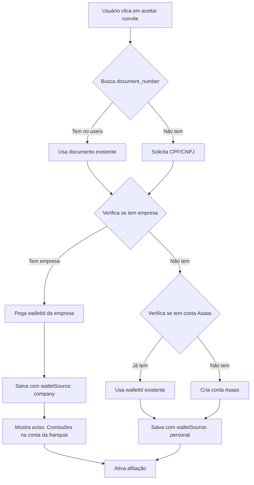

# Estratégia de Carteira Digital para Afiliados

## 📋 Contexto do Problema

### Limitação do Asaas:
- **1 conta por CPF/CNPJ**: O Asaas só permite uma conta digital por documento
- **Split sem identificação própria**: Os splits não têm campos de identificação (apenas o checkout tem `externalReference`)
- **Afiliado pode ter franquia**: Se o afiliado já é dono de uma franquia, já tem `walletId` registrado

### Cenário Real:
1. **João** (CPF 123.456.789-00) é dono da "Loja A" → Tem `walletId: "abc123"`
2. **Maria** (dona da "Loja B") convida João para ser afiliado
3. João aceita e precisa receber comissões das vendas da "Loja B"
4. **Problema**: João não pode criar outra conta Asaas com o mesmo CPF

## ✅ Solução Implementada

### 1. Reutilização de Wallet Existente

Se o afiliado já possui franquia (empresa) registrada:
- **Usar o `walletId` da empresa dele**
- Deixar claro na UI que comissões cairão na mesma conta da franquia
- Adicionar campo `walletSource` para identificar origem

```typescript
// Collection: affiliated
{
  id: "affiliate123",
  user: "userId",
  company_relationed: "companyId", // Empresa que o convidou
  walletId: "abc123", // WalletId da empresa DO AFILIADO (se tiver)
  walletSource: "company", // "company" | "personal"
  ownCompanyId: "lojaAId", // ID da empresa do afiliado (se for dono)
  ...
}
```

### 2. Criação de Conta Nova

Se o afiliado NÃO tem franquia:
- Iniciar fluxo de criação de conta Asaas
- Pedir documento (CPF/CNPJ) se não existir em `users`
- Criar conta digital pessoal no Asaas
- Salvar `walletId` gerado

## 🔄 Fluxo de Aceitação de Convite



## 🎯 Identificação de Origem do Split

### Problema:
- Split não tem campos personalizáveis
- Webhook retorna apenas `walletId`, `value`, `status`
- Como saber se é comissão de afiliado ou venda de franquia?

### Solução:

Usar o `externalReference` do **Checkout** para rastrear:

```typescript
// No momento de criar o checkout
const checkoutPayload = {
  // ... outros campos
  externalReference: JSON.stringify({
    orderId: "order_123",
    type: "AFFILIATE_COMMISSION", // ou "STORE_SALE"
    affiliateId: "affiliate_abc",
    companyId: "company_xyz",
    couponCode: "CUPOM10"
  })
}
```

### Rastreamento no Webhook:

Quando o webhook `PAYMENT_CONFIRMED` chegar:
1. Buscar o payment pelo ID
2. Ler o `externalReference`
3. Parsear o JSON
4. Identificar se é comissão de afiliado
5. Registrar na collection `affiliate_sales`

```typescript
// Webhook handler
async function handlePaymentConfirmed(payment) {
  const ref = JSON.parse(payment.externalReference)
  
  if (ref.type === "AFFILIATE_COMMISSION") {
    // É comissão de afiliado
    await registerAffiliateSale({
      affiliateId: ref.affiliateId,
      companyId: ref.companyId,
      orderId: ref.orderId,
      couponUsed: ref.couponCode,
      orderValue: payment.value,
      commissionValue: calculateCommission(payment.value, affiliate.commissionRate),
      status: "CONFIRMED",
      paymentStatus: "PAID",
      saleDate: new Date()
    })
  }
}
```

## 📝 Estrutura de Dados Atualizada

### Collection: `affiliated`
```typescript
{
  id: string
  user: string // userId do afiliado
  company_relationed: string // Empresa que o convidou
  walletId: string // WalletId para receber comissões
  walletSource: "company" | "personal" // Origem da wallet
  ownCompanyId?: string // Se tiver empresa própria
  active: "SIM" | "NAO"
  commissionRate: number
  invite_code: string
  email: string
  name: string
  whatsapp: string
  createdAt: Date
  updatedAt: Date
}
```

### Collection: `affiliate_sales`
```typescript
{
  id: string
  affiliateId: string
  companyId: string // Empresa que vendeu
  orderId: string
  customerEmail: string
  couponUsed?: string
  orderValue: number
  commissionValue: number
  status: "PENDING" | "CONFIRMED" | "CANCELLED"
  paymentStatus: "PENDING" | "PAID" | "FAILED"
  saleDate: Date
  
  // Metadados para rastreamento
  splitId?: string // ID do split no Asaas
  walletId: string // Wallet que recebeu
  paymentId: string // ID do payment no Asaas
}
```

## 🎨 Interface do Usuário

### Tela de Aceitar Convite

```tsx
function AcceptAffiliateInvite() {
  // 1. Verifica se usuário tem documento
  const userDoc = await getUserDocument(userId)
  
  // 2. Verifica se tem empresa
  const userCompany = await getCompanyByDocument(userDoc)
  
  // 3. Mostra aviso adequado
  if (userCompany) {
    return (
      <Alert type="info">
        ✅ Você já possui uma franquia cadastrada!
        <br />
        As comissões de afiliado serão depositadas na mesma conta 
        digital da sua franquia "{userCompany.name}".
        <br />
        <strong>WalletId:</strong> {userCompany.walletId}
      </Alert>
    )
  } else {
    return (
      <Alert type="success">
        🎉 Você receberá suas comissões em uma conta digital exclusiva!
        <br />
        Vamos criar sua conta Asaas agora.
      </Alert>
    )
  }
}
```

### Indicador no Dashboard do Afiliado

```tsx
function MyAffiliationTab() {
  return (
    <div>
      {affiliate.walletSource === "company" && (
        <Alert type="warning">
          ⚠️ <strong>Importante:</strong> Suas comissões de afiliado estão 
          sendo depositadas na conta digital da sua franquia 
          "{company.name}". Verifique o extrato da sua empresa para 
          acompanhar os recebimentos.
        </Alert>
      )}
      
      {/* Resto do dashboard */}
    </div>
  )
}
```

## 🔧 Implementação Técnica

### 1. Endpoint: Aceitar Convite

```typescript
// /api/affiliate/accept-invite
async function acceptInvite(token: string, userId: string) {
  // 1. Validar token
  const invite = await getInviteByToken(token)
  if (!invite || invite.status !== "PENDING") {
    throw new Error("Convite inválido")
  }
  
  // 2. Buscar documento do usuário
  const user = await getUserById(userId)
  let documentNumber = user.document_number
  
  // 3. Se não tem documento, solicitar
  if (!documentNumber) {
    return { requiresDocument: true }
  }
  
  // 4. Verificar se tem empresa com esse documento
  const company = await getCompanyByDocument(documentNumber)
  
  let walletId: string
  let walletSource: "company" | "personal"
  let ownCompanyId: string | undefined
  
  if (company) {
    // Usar wallet da empresa
    walletId = company.walletId
    walletSource = "company"
    ownCompanyId = company.id
  } else {
    // Verificar se já tem conta Asaas pessoal
    const existingWallet = await checkAsaasAccount(documentNumber)
    
    if (existingWallet) {
      walletId = existingWallet.walletId
      walletSource = "personal"
    } else {
      // Criar conta Asaas
      const newWallet = await createAsaasAccount({
        name: user.display_name,
        email: user.email,
        cpfCnpj: documentNumber,
        phone: user.phone_number
      })
      walletId = newWallet.walletId
      walletSource = "personal"
    }
  }
  
  // 5. Criar registro de afiliado
  await createAffiliate({
    user: userId,
    company_relationed: invite.storeId,
    walletId,
    walletSource,
    ownCompanyId,
    commissionRate: invite.commissionRate,
    invite_code: generateInviteCode(),
    email: user.email,
    name: user.display_name,
    whatsapp: user.phone_number,
    active: "SIM"
  })
  
  // 6. Atualizar convite
  await updateInvite(invite.id, { status: "ACCEPTED" })
  
  return { 
    success: true, 
    walletSource,
    companyName: company?.name 
  }
}
```

### 2. Webhook: Registrar Venda de Afiliado

```typescript
// /api/webhooks/asaas
async function handleWebhook(event: AsaasWebhookEvent) {
  if (event.event === "PAYMENT_CONFIRMED") {
    const payment = await getAsaasPayment(event.payment.id)
    
    // Parse externalReference
    const ref = JSON.parse(payment.externalReference || "{}")
    
    if (ref.type === "AFFILIATE_COMMISSION" && ref.affiliateId) {
      // Registrar venda de afiliado
      await createAffiliateSale({
        affiliateId: ref.affiliateId,
        companyId: ref.companyId,
        orderId: ref.orderId,
        customerEmail: payment.customer.email,
        couponUsed: ref.couponCode,
        orderValue: payment.value,
        commissionValue: ref.commissionValue, // Já calculado no checkout
        status: "CONFIRMED",
        paymentStatus: "PAID",
        saleDate: new Date(),
        paymentId: payment.id,
        walletId: findWalletIdInSplits(payment.split)
      })
    }
  }
}
```

## ✅ Checklist de Implementação

### Fase 1: Banco de Dados
- [ ] Adicionar campo `walletSource` em `affiliated`
- [ ] Adicionar campo `ownCompanyId` em `affiliated`
- [ ] Adicionar campo `document_number` em `users` (se não existir)

### Fase 2: Backend
- [ ] Criar função `getCompanyByDocument()`
- [ ] Criar função `checkAsaasAccount()`
- [ ] Criar função `createAsaasAccount()`
- [ ] Criar endpoint `/api/affiliate/accept-invite`
- [ ] Atualizar webhook para registrar affiliate_sales

### Fase 3: Frontend
- [ ] Criar página `/affiliate/accept?token=xxx`
- [ ] Formulário para solicitar documento (se necessário)
- [ ] Aviso sobre wallet compartilhada (se for empresa)
- [ ] Atualizar dashboard de afiliado com indicador

### Fase 4: Testes
- [ ] Testar aceitação com empresa existente
- [ ] Testar aceitação sem empresa (criação nova)
- [ ] Testar webhook registrando affiliate_sales
- [ ] Testar dashboard mostrando corretamente

## 🎯 Próximos Passos Imediatos

1. **Atualizar tipos TypeScript** com novos campos
2. **Criar página de aceitação de convite**
3. **Implementar lógica de verificação de wallet**
4. **Adicionar avisos na UI** sobre wallet compartilhada
5. **Testar fluxo completo** em sandbox

---

**Observação Importante**: Deixar MUITO claro para afiliados que já têm franquia que as comissões cairão na mesma conta. Isso evita confusão e problemas de suporte.
