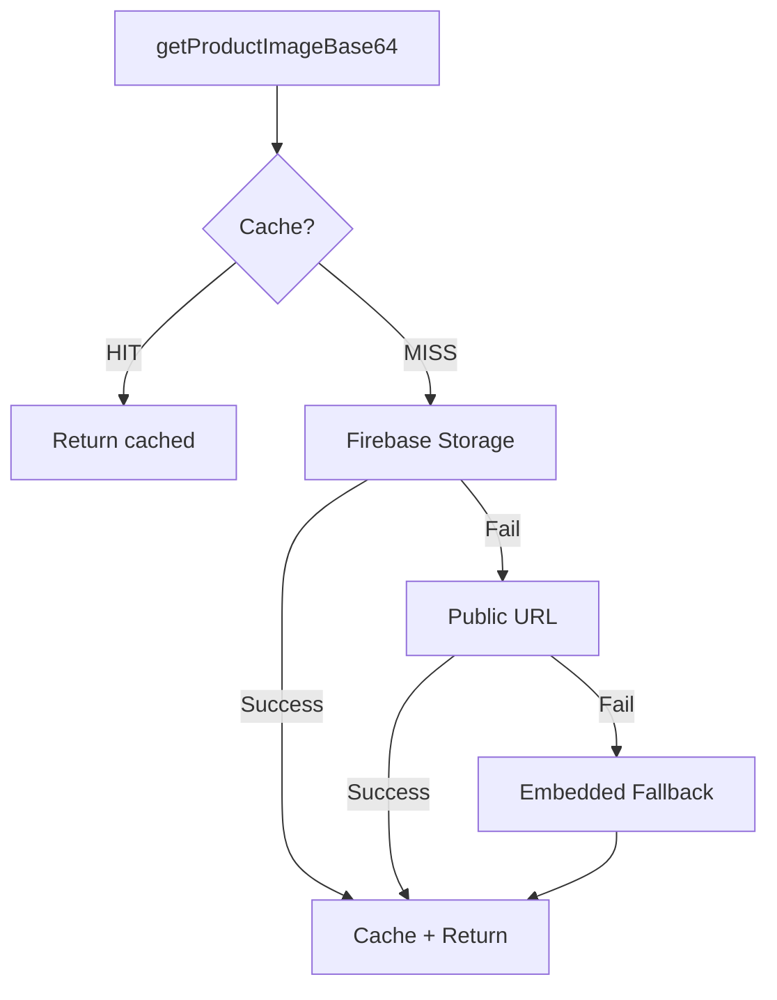

# 🖼️ Image Provider System - Documentação Técnica

## 📋 Visão Geral

Sistema enterprise-grade para gerenciamento de imagens de produtos com **fallback automático em cascata**, **circuit breaker**, **cache** e **múltiplas estratégias**.

### **Problema Resolvido**
O Asaas/N8N **exige** imagem base64 para cada produto. Usuários podem esquecer de adicionar imagens. Ambientes serverless/edge **não suportam `fs.readFileSync()`**.

### **Solução**
Arquitetura baseada em **Design Patterns** com 3 níveis de fallback:
1. **Firebase Storage** (CDN rápida) - Priority 1
2. **Public URL** (/public do Next.js) - Priority 2  
3. **Embedded Fallback** (base64 hardcoded no código) - Priority 99

---

## 🏗️ Arquitetura

### **Design Patterns Aplicados**

#### **1. Strategy Pattern**
Diferentes estratégias de busca de imagem são intercambiáveis:
```typescript
interface ImageProvider {
  getImage(productImage?: string): Promise<ImageProviderResult>
}

// Implementações:
class FirebaseStorageProvider implements ImageProvider { }
class PublicUrlProvider implements ImageProvider { }
class EmbeddedFallbackProvider implements ImageProvider { }
```

#### **2. Chain of Responsibility**
Tenta providers em cascata até um suceder:
```
Product.image → Firebase Storage → Public URL → Embedded Fallback → ✅ SEMPRE TEM IMAGEM
```

#### **3. Circuit Breaker Pattern**
Se um provider falha 3x consecutivas, abre circuito por 1 minuto:
```typescript
if (this.circuitOpen) {
  return { success: false, error: 'Circuit breaker open' }
}
```

#### **4. Singleton Pattern**
Uma única instância do `ImageService` compartilhada:
```typescript
const service = ImageService.getInstance()
```

#### **5. Template Method Pattern**
`BaseImageProvider` define o fluxo, subclasses implementam detalhes:
```typescript
abstract class BaseImageProvider {
  async getImage() {
    // 1. Check circuit breaker
    // 2. Call fetchImage() (implementado por subclass)
    // 3. Handle success/failure
    // 4. Update circuit breaker state
  }
  
  protected abstract fetchImage(): Promise<ImageProviderResult>
}
```

---

## 📊 Fluxo de Execução



---

## 🔧 Uso

### **Básico (Recomendado)**
```typescript
import { getProductImageBase64 } from '@/lib/image-providers'

const imageBase64 = await getProductImageBase64(product.image)
// ✅ SEMPRE retorna uma imagem (nunca undefined)
```

### **Avançado (Configuração customizada)**
```typescript
import { ImageService } from '@/lib/image-providers'

const service = ImageService.getInstance({
  firebaseStorageUrl: 'https://storage.googleapis.com/bucket/default.jpg',
  enableCache: true,
  cacheMaxAge: 3600000, // 1 hora
  circuitBreakerThreshold: 3,
  circuitBreakerTimeout: 60000 // 1 minuto
})

const base64 = await service.getProductImageBase64(product.image)
const health = service.getProvidersHealth()
// { FirebaseStorage: true, PublicURL: false, EmbeddedFallback: true }
```

---

## 🎯 Providers

### **1. FirebaseStorageProvider** (Priority 1)

**Quando usa:**
- Produto tem `image` URL própria → usa ela
- Produto sem imagem → busca da URL em `NEXT_PUBLIC_DEFAULT_PRODUCT_IMAGE_URL`

**Vantagens:**
- ✅ CDN global (baixa latência)
- ✅ Confiável (99.9% uptime Firebase)
- ✅ Escalável

**Circuit Breaker:**
- 3 falhas consecutivas = circuito aberto por 1 minuto
- Timeout: 10 segundos por tentativa

**Exemplo de configuração:**
```env
NEXT_PUBLIC_DEFAULT_PRODUCT_IMAGE_URL=https://firebasestorage.googleapis.com/v0/b/xeco-app.appspot.com/o/defaults%2Fproduct.jpg?alt=media
```

---

### **2. PublicUrlProvider** (Priority 2)

**Quando usa:**
- Firebase falhou ou está com circuito aberto
- Busca de `/public/default-product-image.png` do Next.js

**Vantagens:**
- ✅ Sem dependência externa
- ✅ Funciona offline (localhost)
- ✅ Zero custo

**Desvantagens:**
- ⚠️ Não funciona em Edge Runtime
- ⚠️ Sem CDN (mais lento em produção)

**Timeout:** 5 segundos (mais agressivo que Firebase)

---

### **3. EmbeddedFallbackProvider** (Priority 99)

**Quando usa:**
- TODOS os outros providers falharam (raro)
- Garante que **SEMPRE** tem imagem

**Como funciona:**
- Base64 da imagem está **hardcoded** no código TypeScript
- Imagem 400x400px JPEG (~8-15KB)
- Placeholder genérico (gradiente cinza)

**Vantagens:**
- ✅ **100% confiável** (nunca falha)
- ✅ Funciona em QUALQUER ambiente
- ✅ Zero latência (já está na memória)

**Desvantagens:**
- ⚠️ Aumenta bundle size (~10KB)
- ⚠️ Difícil de atualizar (precisa redeploy)

**Como atualizar a imagem embedded:**
```bash
# 1. Criar imagem 400x400px JPEG quality 85%
# 2. Converter para base64
cat default-product.jpg | base64 | tr -d '\n'

# 3. Substituir constante EMBEDDED_DEFAULT_IMAGE em:
# src/lib/image-providers/embedded-fallback-provider.ts
```

---

## 🚀 Performance

### **Cache**
- **Enabled por padrão** (pode desabilitar via config)
- **TTL:** 1 hora (3600000ms)
- **Key:** URL da imagem OU 'default'
- **Storage:** In-memory Map (não persiste entre deploys)

**Métricas:**
```typescript
const stats = ImageService.getInstance().getCacheStats()
// { size: 5, keys: ['default', 'https://...', ...] }
```

**Limpar cache:**
```typescript
ImageService.getInstance().clearCache()
```

### **Latência Típica**

| Provider | Cache HIT | Cache MISS (Success) | Failure |
|----------|-----------|----------------------|---------|
| Firebase | 0ms | 100-300ms | 10s timeout |
| Public URL | 0ms | 50-200ms | 5s timeout |
| Embedded | 0ms | <1ms | Never fails |

---

## 🛡️ Resiliência

### **Circuit Breaker**

**Estados:**
- **Closed** (normal): Requisições passam
- **Open** (falhou 3x): Falha rápido por 1 minuto
- **Half-Open** (após timeout): Tenta 1 requisição pra testar

**Benefícios:**
- ✅ Evita sobrecarga de provider que está falhando
- ✅ Fail fast (não desperdiça tempo tentando provider ruim)
- ✅ Auto-recuperação após 1 minuto

**Monitoramento:**
```typescript
const health = ImageService.getInstance().getProvidersHealth()
console.log(health)
// {
//   FirebaseStorage: true,   // ✅ Healthy
//   PublicURL: false,         // ❌ Circuit open
//   EmbeddedFallback: true    // ✅ Always healthy
// }
```

---

## 🔬 Testes

### **Unit Tests (Recomendado)**
```typescript
import { ImageService } from '@/lib/image-providers'

describe('ImageService', () => {
  it('should return cached image on second call', async () => {
    const service = ImageService.getInstance({ enableCache: true })
    
    const first = await service.getProductImageBase64('https://example.com/image.jpg')
    const second = await service.getProductImageBase64('https://example.com/image.jpg')
    
    // Second call should be instant (cache)
    expect(second).toBe(first)
  })

  it('should fallback to embedded when all providers fail', async () => {
    const service = ImageService.getInstance({
      firebaseStorageUrl: 'https://invalid-url.com',
      publicImageUrl: 'https://invalid-url.com'
    })
    
    const base64 = await service.getProductImageBase64()
    
    expect(base64).toContain('data:image/jpeg;base64,')
    expect(base64.length).toBeGreaterThan(100) // Embedded image is ~8KB
  })

  it('should open circuit after 3 failures', async () => {
    const service = ImageService.getInstance()
    const provider = service['providers'][0] // FirebaseStorageProvider
    
    // Simulate 3 failures
    await provider.getImage('https://invalid.com')
    await provider.getImage('https://invalid.com')
    await provider.getImage('https://invalid.com')
    
    expect(provider.isHealthy()).toBe(false)
  })
})
```

### **Integration Test**
```typescript
it('should work in checkout flow', async () => {
  const products = [
    { id: '1', image: 'https://example.com/product1.jpg' },
    { id: '2', image: undefined } // Produto sem imagem
  ]
  
  const items = await Promise.all(
    products.map(async (p) => ({
      id: p.id,
      imageBase64: await getProductImageBase64(p.image)
    }))
  )
  
  expect(items[0].imageBase64).toContain('data:image/')
  expect(items[1].imageBase64).toContain('data:image/') // Deve ter fallback
})
```

---

## 📦 Estrutura de Arquivos

```
src/lib/image-providers/
├── index.ts                          # Public API
├── types.ts                          # TypeScript interfaces
├── base-provider.ts                  # Abstract base class (Template Method)
├── firebase-storage-provider.ts      # Priority 1
├── public-url-provider.ts            # Priority 2
├── embedded-fallback-provider.ts     # Priority 99 (Always succeeds)
└── image-service.ts                  # Singleton manager
```

---

## 🚨 Troubleshooting

### **"All providers failed"**
**Causa:** Raro, mas pode acontecer se:
- Firebase Storage URL inválida
- Public URL inválida
- Embedded fallback removido (NUNCA faça isso!)

**Solução:**
1. Verificar logs: qual provider falhou e por quê
2. Verificar env var `NEXT_PUBLIC_DEFAULT_PRODUCT_IMAGE_URL`
3. Verificar se arquivo `/public/default-product-image.png` existe

### **"Circuit breaker open"**
**Causa:** Provider falhou 3x consecutivas

**Solução:**
1. Aguardar 1 minuto (circuit fecha automaticamente)
2. Verificar saúde: `ImageService.getInstance().getProvidersHealth()`
3. Investigar logs do provider que falhou

### **Cache não está funcionando**
**Causa:** Cache desabilitado ou TTL muito curto

**Solução:**
```typescript
ImageService.getInstance({
  enableCache: true,
  cacheMaxAge: 3600000 // 1 hora
})
```

### **Imagens grandes (>100KB)**
**Causa:** Produto tem imagem muito pesada

**Solução:**
- Otimizar imagem antes de salvar no Firestore
- Usar Firebase Cloud Functions para resize automático
- Implementar Sharp no FirebaseStorageProvider (se necessário)

---

## 🎯 Configuração de Produção

### **1. Upload da imagem padrão no Firebase Storage**

```bash
# 1. Criar imagem 400x400px JPEG quality 85% (~15-30KB)
# 2. Upload via Firebase Console:
#    Storage > Upload > defaults/product.jpg
# 3. Copiar URL pública
# 4. Adicionar em .env.production:

NEXT_PUBLIC_DEFAULT_PRODUCT_IMAGE_URL=https://firebasestorage.googleapis.com/v0/b/xeco-app.appspot.com/o/defaults%2Fproduct.jpg?alt=media
```

### **2. Adicionar imagem em /public (backup)**

```bash
# Copiar imagem para Next.js public folder
cp default-product.jpg public/default-product-image.png
```

### **3. Configurar env vars**

```env
# .env.production
NEXT_PUBLIC_DEFAULT_PRODUCT_IMAGE_URL=https://firebasestorage.googleapis.com/v0/b/xeco-app.appspot.com/o/defaults%2Fproduct.jpg?alt=media
NEXT_PUBLIC_APP_URL=https://xeco.com.br
```

### **4. Deploy**

```bash
# Vercel/Railway detecta automaticamente
git push origin main
```

---

## ✅ Checklist de Implementação

- [x] Criar interfaces TypeScript (`types.ts`)
- [x] Implementar `BaseImageProvider` (Template Method + Circuit Breaker)
- [x] Implementar `FirebaseStorageProvider` (Priority 1)
- [x] Implementar `PublicUrlProvider` (Priority 2)
- [x] Implementar `EmbeddedFallbackProvider` (Priority 99)
- [x] Implementar `ImageService` (Singleton + Manager)
- [x] Aplicar no checkout API
- [x] Documentar uso e configuração
- [ ] Upload imagem padrão no Firebase Storage
- [ ] Adicionar imagem em `/public`
- [ ] Configurar env vars produção
- [ ] Testes unitários
- [ ] Testes de integração
- [ ] Deploy e validação

---

## 📚 Referências

- [Design Patterns Gang of Four](https://refactoring.guru/design-patterns)
- [SOLID Principles](https://en.wikipedia.org/wiki/SOLID)
- [Circuit Breaker Pattern - Martin Fowler](https://martinfowler.com/bliki/CircuitBreaker.html)
- [Clean Architecture - Robert C. Martin](https://blog.cleancoder.com/uncle-bob/2012/08/13/the-clean-architecture.html)

---

## 🤝 Contribuindo

Para adicionar um novo provider:

1. Criar classe que estende `BaseImageProvider`
2. Implementar `fetchImage()` e `getSource()`
3. Definir `priority` (lower = higher priority)
4. Registrar em `ImageService.initializeProviders()`

```typescript
export class CustomProvider extends BaseImageProvider {
  readonly name = 'CustomProvider'
  readonly priority = 1.5 // Entre Firebase (1) e PublicURL (2)

  protected async fetchImage(productImage?: string): Promise<ImageProviderResult> {
    // Sua lógica aqui
  }

  protected getSource(): ImageProviderResult['source'] {
    return 'firebase' // ou 'public-url' ou novo tipo
  }
}
```
