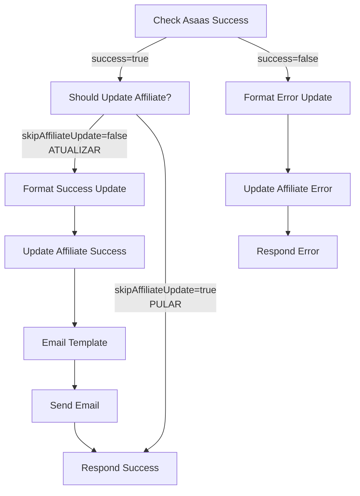

# Como Configurar Skip Affiliate Update no n8n

## ✅ Mudanças já Implementadas no Código

1. **Type Interface atualizado** (`src/lib/n8n-config.ts`):
   - ✅ `affiliateId` agora é opcional
   - ✅ Adicionado campo `skipAffiliateUpdate?: boolean`

2. **Código do Process Asaas Response atualizado** (workflow JSON):
   - ✅ Agora lê `previousData.originalData.skipAffiliateUpdate`
   - ✅ Retorna `skipAffiliateUpdate: !shouldUpdateAffiliate` na resposta

3. **Fluxo do Frontend atualizado** (`AffiliateAcceptForm.tsx`):
   - ✅ PASSO 1: Cria conta Asaas com `skipAffiliateUpdate: true`
   - ✅ PASSO 2: Cria afiliado com `walletId` + `cpfCnpj`

## 🔧 Mudanças Necessárias no n8n UI

Você precisa adicionar um novo nó condicional no workflow n8n para verificar se deve pular a atualização do afiliado.

### Passo a Passo:

1. **Abra o workflow** "Affiliate Asaas Account Creation" no n8n

2. **Adicione um novo nó IF** entre "Check Asaas Success" e "Format Success Update":
   - Nome: `Should Update Affiliate?`
   - Tipo: `If`
   - Posição: Entre "Check Asaas Success" (success output) e "Format Success Update"

3. **Configure a condição**:
   ```
   Campo: {{ $json.skipAffiliateUpdate }}
   Operador: equals (boolean)
   Valor: true
   ```

4. **Reconecte os nós**:

   **ANTES** (fluxo atual):
   ```
   Check Asaas Success (success) → Format Success Update
   ```

   **DEPOIS** (novo fluxo):
   ```
   Check Asaas Success (success) → Should Update Affiliate?
   
   Should Update Affiliate? (false - deve atualizar):
     → Format Success Update → Update Affiliate Success → ... → Respond Success
   
   Should Update Affiliate? (true - pular atualização):
     → Respond Success (direto, sem atualizar afiliado)
   ```

5. **Importante**: O output "true" do "Should Update Affiliate?" vai **direto** para o nó "Respond Success", pulando toda a parte de atualização do Firestore e envio de email.

## 📊 Fluxo Visual



## 🧪 Testando

Após fazer as mudanças:

1. **Teste com skipAffiliateUpdate = true** (novo fluxo):
   - Payload deve incluir `skipAffiliateUpdate: true`
   - Esperado: Cria conta Asaas, retorna walletId, **não** atualiza afiliado no Firestore
   - Resposta: `{ success: true, walletId: "xxx", accountId: "yyy" }`

2. **Teste com skipAffiliateUpdate = false ou undefined** (fluxo antigo):
   - Payload **sem** `skipAffiliateUpdate` ou com `skipAffiliateUpdate: false`
   - Esperado: Cria conta Asaas, atualiza afiliado no Firestore, envia email
   - Resposta: `{ success: true, walletId: "xxx", accountId: "yyy" }`

## 🐛 Troubleshooting

**Problema**: "affiliateId undefined" no Update Affiliate Success
- **Causa**: skipAffiliateUpdate não está funcionando corretamente
- **Solução**: Verifique se o nó "Should Update Affiliate?" está configurado corretamente e conectado ao "Respond Success"

**Problema**: Loop infinito no frontend
- **Causa**: Frontend está passando skipAffiliateUpdate mas n8n ainda tenta atualizar afiliado
- **Solução**: Certifique-se de que o nó condicional está funcionando e que o caminho "true" pula completamente a atualização

## 📝 Notas

- Quando `skipAffiliateUpdate: true`, o workflow n8n **apenas cria a conta Asaas** e retorna o walletId
- O frontend então usa esse walletId para criar o afiliado no Firestore diretamente
- Isso resolve o problema de tentar atualizar um afiliado que ainda não existe
