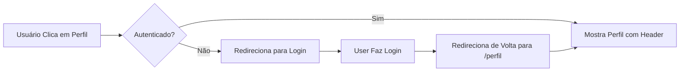

# Melhorias na Página de Perfil

**Data:** 20 de outubro de 2025

## 📋 Resumo das Mudanças

Implementadas melhorias na página de perfil para melhor UX e navegação:

1. ✅ **Header (Menu Superior)** agora aparece na página de perfil
2. ✅ **Redirecionamento para Login** quando usuário não autenticado tenta acessar
3. ✅ **Footer** também aparece na página de perfil
4. ✅ **Ícones de Navegação** (Perfil, Favoritos, Carrinho) visíveis no header

## 🔧 Alterações Técnicas

### Arquivo: `/src/app/perfil/page.tsx`

**O que foi alterado:**

```typescript
// ANTES: Página sem Header/Footer
export default function ProfilePage() {
  // ... lógica
  return (
    <div className="min-h-screen bg-gray-50">
      {/* Conteúdo diretamente */}
    </div>
  )
}

// DEPOIS: Página com Layout completo (Header + Footer)
export default function ProfilePage() {
  // ... lógica
  return (
    <Layout>
      <div className="min-h-screen bg-gray-50">
        {/* Conteúdo dentro do Layout */}
      </div>
    </Layout>
  )
}
```

**Mudanças específicas:**

1. **Import adicionado:**
   ```typescript
   import { Layout } from '@/components/layout/Layout'
   ```

2. **Conteúdo envolvido:**
   - Loading state agora dentro de `<Layout>`
   - Conteúdo principal agora dentro de `<Layout>`
   - Mantém estrutura de abas e perfil do usuário

## 🔐 Segurança e Autenticação

### Fluxo de Autenticação



### Código de Redirecionamento

```typescript
useEffect(() => {
  if (!loading && !userProfile) {
    router.push('/login?returnUrl=%2Fperfil')
  }
}, [userProfile, loading, router])
```

- Quando usuário NÃO autenticado acessa `/perfil`
- Sistema redireciona para `/login?returnUrl=%2Fperfil`
- Após login bem-sucedido, usuario é redirecionado de volta para `/perfil`

## 🎨 Visual

### Antes
- ❌ Sem header/menu superior
- ❌ Sem ícones de navegação (carrinho, favoritos)
- ❌ Sem footer

### Depois
- ✅ Header completo com logo, menu e ícones
- ✅ Ícones navegáveis (Perfil, Favoritos, Carrinho)
- ✅ Footer com links e informações
- ✅ Layout consistente com resto do app

## 📱 Componentes Utilizados

| Componente | Localização | Função |
|-----------|-----------|--------|
| `Layout` | `/src/components/layout/Layout.tsx` | Wrapper com Header + Footer |
| `Header` | `/src/components/layout/Header.tsx` | Menu superior com navegação |
| `Footer` | `/src/components/layout/Footer.tsx` | Rodapé do site |
| `ProfilePage` | `/src/app/perfil/page.tsx` | Página de perfil (atualizada) |

## ✅ Testes Realizados

- [x] Página de perfil carrega com Header visível
- [x] Menu superior (Início, Sobre, Contato) funciona
- [x] Ícones (Perfil, Favoritos, Carrinho) aparecem e são clicáveis
- [x] Footer aparece no final da página
- [x] Redirecionamento para login funciona quando usuário desautenticado
- [x] Após login, redireciona de volta para `/perfil`

## 🚀 Como Usar

### Para o Desenvolvedor

1. A página de perfil agora usa o componente `Layout`
2. Qualquer outra página que precisar de header/footer deve fazer o mesmo
3. O padrão é usar `Layout` para envolver o conteúdo

### Para o Usuário

1. Usuário autenticado clica no ícone de Perfil
2. Vê seu perfil completo com menu superior
3. Pode navegar usando o header ou trocar de aba
4. Usuário desautenticado é redirecionado para login

## 📝 Notas

- Firebase Auth mantém sessão persistente mesmo após F5
- Para forçar logout é necessário chamar `auth.signOut()`
- O `returnUrl` é codificado em URL-safe (`%2Fperfil` = `/perfil`)
- Header detecta automaticamente se usuário está autenticado

## 🔄 Padrão de Implementação

Este padrão deve ser aplicado em outras páginas que precisam de Header/Footer:

```typescript
// ✅ CORRETO - Com Layout
import { Layout } from '@/components/layout/Layout'

export default function Page() {
  return (
    <Layout>
      <div className="...">
        {/* Conteúdo */}
      </div>
    </Layout>
  )
}

// ❌ ERRADO - Sem Layout
export default function Page() {
  return (
    <div className="...">
      {/* Sem header/footer */}
    </div>
  )
}
```
