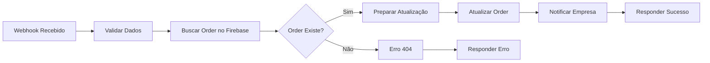

# 🔔 Webhook de Confirmação de Pagamento - Xeco

## 📋 Visão Geral

Webhook N8N que processa notificações do Asaas quando um pagamento é confirmado.

## 🎯 Funcionalidades

1. ✅ **Recebe webhook** do Asaas com evento `PAYMENT_CONFIRMED`
2. ✅ **Valida** dados obrigatórios (orderId, paymentId, etc)
3. ✅ **Busca** a order no Firebase pelo `externalReference` (orderId)
4. ✅ **Atualiza** status da order e adiciona dados do pagamento
5. ✅ **Notifica** empresa/cliente (desabilitado por padrão)
6. ✅ **Responde** sucesso ou erro ao Asaas

## 📡 Endpoint

```
POST https://seu-n8n.railway.app/webhook/xeco-confirm-payment
```

## 📥 Payload do Asaas (Exemplo)

```json
{
  "event": "PAYMENT_CONFIRMED",
  "payment": {
    "id": "pay_1234567890",
    "customer": "cus_000000000001",
    "externalReference": "hqAmTlS7VT6nL11FQB2T",
    "value": 142.32,
    "netValue": 135.80,
    "status": "CONFIRMED",
    "billingType": "CREDIT_CARD",
    "confirmedDate": "2025-10-22",
    "paymentDate": "2025-10-22T10:30:00Z",
    "invoiceUrl": "https://...",
    "transactionReceiptUrl": "https://...",
    "estimatedCreditDate": "2025-10-23"
  }
}
```

## 🔄 Fluxo do Workflow



## 📊 Dados Atualizados na Order

| Campo | Descrição | Origem |
|-------|-----------|--------|
| `asaasPaymentId` | ID do pagamento no Asaas | `payment.id` |
| `asaasCustomerId` | ID do cliente no Asaas | `payment.customer` |
| `paymentStatus` | Status Asaas | `payment.status` |
| `status` | Status interno | `PAYMENT_CONFIRMED` |
| `netValue` | Valor líquido | `payment.netValue` |
| `grossValue` | Valor bruto | `payment.value` |
| `billingType` | Tipo de cobrança | `payment.billingType` |
| `confirmedDate` | Data confirmação | `payment.confirmedDate` |
| `invoiceUrl` | URL da nota fiscal | `payment.invoiceUrl` |
| `transactionReceiptUrl` | URL do recibo | `payment.transactionReceiptUrl` |
| `estimatedCreditDate` | Previsão de crédito | `payment.estimatedCreditDate` |

## 🔐 Validações

### Webhook Validation Node

- ✅ Campo `event` existe e = `PAYMENT_CONFIRMED`
- ✅ Campo `payment` existe
- ✅ Campo `payment.id` existe
- ✅ Campo `payment.externalReference` existe (orderId)

### Order Validation

- ✅ Order existe no Firebase
- ✅ Order tem ID válido

## 📤 Respostas

### ✅ Sucesso (200)

```json
{
  "success": true,
  "message": "Pagamento confirmado com sucesso",
  "orderId": "hqAmTlS7VT6nL11FQB2T",
  "paymentId": "pay_1234567890",
  "status": "CONFIRMED",
  "netValue": 135.80,
  "billingType": "CREDIT_CARD",
  "timestamp": "2025-10-22T13:30:00.000Z"
}
```

### ❌ Order Não Encontrada (404)

```json
{
  "success": false,
  "error": "ORDER_NOT_FOUND",
  "message": "Pedido não encontrado no Firebase",
  "orderId": "hqAmTlS7VT6nL11FQB2T",
  "timestamp": "2025-10-22T13:30:00.000Z"
}
```

### ❌ Evento Inválido (500)

```json
{
  "error": "Evento inválido: PAYMENT_UPDATED. Esperado: PAYMENT_CONFIRMED"
}
```

## 🚀 Deploy no N8N

### 1. Importar Workflow

```bash
# Copiar arquivo para clipboard
cat workflows/webhook-confirm-payment.json | pbcopy

# No N8N:
# 1. Clicar em "Add workflow"
# 2. Clicar nos 3 pontinhos > "Import from file"
# 3. Colar JSON
```

### 2. Configurar Credenciais

**Firebase Service Account:**
- Nome: `Firebase Service Account`
- Tipo: `Google Service Account`
- JSON: Usar o service account do Firebase

### 3. Ativar Webhook

- Clicar em "Active" no canto superior direito
- Copiar URL do webhook gerado

### 4. Configurar no Asaas

```bash
# Dashboard Asaas > Configurações > Webhooks
URL: https://seu-n8n.railway.app/webhook/xeco-confirm-payment
Eventos: PAYMENT_CONFIRMED
```

## 🧪 Testar Webhook

### Teste Manual (cURL)

```bash
curl -X POST https://seu-n8n.railway.app/webhook/xeco-confirm-payment \
  -H "Content-Type: application/json" \
  -d '{
    "event": "PAYMENT_CONFIRMED",
    "payment": {
      "id": "pay_test_123",
      "customer": "cus_000000000001",
      "externalReference": "hqAmTlS7VT6nL11FQB2T",
      "value": 142.32,
      "netValue": 135.80,
      "status": "CONFIRMED",
      "billingType": "CREDIT_CARD",
      "confirmedDate": "2025-10-22",
      "paymentDate": "2025-10-22T10:30:00Z",
      "invoiceUrl": "https://sandbox.asaas.com/invoice/123",
      "transactionReceiptUrl": "https://sandbox.asaas.com/receipt/123",
      "estimatedCreditDate": "2025-10-23"
    }
  }'
```

### Teste no Asaas Sandbox

1. Criar um pagamento teste no sandbox
2. Confirmar o pagamento
3. Asaas vai disparar o webhook automaticamente
4. Verificar logs no N8N

## 📧 Notificações (TODO)

O node **"Prepare Notification"** está desabilitado. Para habilitar:

### Opção 1: Email (SendGrid/Resend)

```javascript
// Adicionar node HTTP Request após Update Order
{
  url: 'https://api.resend.com/emails',
  method: 'POST',
  headers: {
    'Authorization': 'Bearer re_...',
    'Content-Type': 'application/json'
  },
  body: {
    from: 'noreply@xeco.com.br',
    to: order.customerEmail,
    subject: 'Pagamento Confirmado! 🎉',
    html: `<h1>Pedido #${order.id} confirmado!</h1>`
  }
}
```

### Opção 2: Push Notification (FCM)

```javascript
// Node HTTP Request
{
  url: 'https://fcm.googleapis.com/fcm/send',
  headers: {
    'Authorization': 'key=YOUR_FCM_KEY',
    'Content-Type': 'application/json'
  },
  body: {
    to: order.userFcmToken,
    notification: {
      title: 'Pagamento Confirmado!',
      body: `Seu pedido #${order.id} foi confirmado`
    }
  }
}
```

### Opção 3: WhatsApp (Twilio)

```javascript
// Node HTTP Request
{
  url: 'https://api.twilio.com/2010-04-01/Accounts/YOUR_SID/Messages.json',
  auth: { user: 'SID', password: 'TOKEN' },
  body: {
    From: 'whatsapp:+14155238886',
    To: `whatsapp:${order.customerPhone}`,
    Body: `🎉 Pagamento confirmado! Pedido #${order.id}`
  }
}
```

## 🔍 Monitoramento

### Logs no N8N

- Ver execuções em "Executions" no menu lateral
- Cada execução mostra todos os nodes e dados

### Queries Firebase para Debug

```javascript
// Buscar orders confirmadas hoje
db.collection('orders')
  .where('status', '==', 'PAYMENT_CONFIRMED')
  .where('paymentConfirmedAt', '>=', new Date().setHours(0,0,0,0))
  .get()

// Buscar order específica
db.collection('orders')
  .doc('hqAmTlS7VT6nL11FQB2T')
  .get()
```

## 🐛 Troubleshooting

### Webhook não é chamado

- ✅ Verificar se workflow está ativo no N8N
- ✅ Verificar URL configurada no Asaas
- ✅ Testar com cURL manual

### Order não atualiza

- ✅ Verificar credenciais Firebase no N8N
- ✅ Verificar se `externalReference` no Asaas = `orderId` no Firebase
- ✅ Ver logs de erro no node "Update Order"

### Erro 404 (Order Not Found)

- ✅ Verificar se order existe no Firebase
- ✅ Verificar se `externalReference` está correto
- ✅ Ver logs do node "Find Order"

## 🎯 Próximos Passos

- [ ] Habilitar notificações (email/push)
- [ ] Adicionar webhook de pagamento recusado
- [ ] Adicionar webhook de reembolso
- [ ] Criar dashboard de métricas
- [ ] Adicionar retry automático em caso de erro

## 📚 Referências

- [Asaas Webhooks](https://docs.asaas.com/docs/webhooks)
- [N8N Docs](https://docs.n8n.io/)
- [Firebase Admin](https://firebase.google.com/docs/admin/setup)

---

**Criado com 🍺 e 🚬 por um Opala 6 cilindros desfilando com uma puta no carona e um corpo no porta-malas** 🔥
